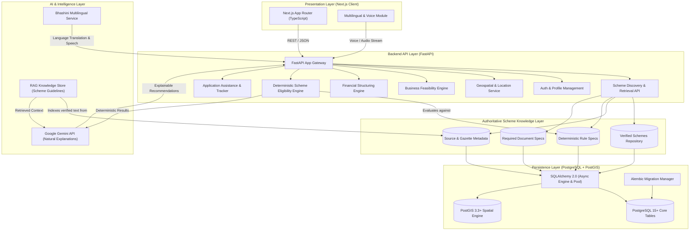

# VittMitra Architecture Specification

## 1. System Overview

VittMitra is designed with an API-first, decoupled architecture separating the Presentation Layer (Next.js), Core Business & API Layer (FastAPI), Persistence Layer (PostgreSQL with PostGIS), Scheme Knowledge Layer, and Intelligence Layer (Deterministic Rule Engines + Grounded Gemini RAG Services).



---

## 2. Deterministic Eligibility Engine Architecture `[STEP 4]`

### A. Authoritative Grounding & Non-Black-Box Principle
VittMitra's Eligibility Engine evaluates an entrepreneur's structured profile inputs against official scheme rules stored in PostgreSQL.

**Crucially, LLMs / Gemini / AI models do NOT participate in eligibility decisions.**

```
Entrepreneur Profile Input (JSON)
              ↓
Safe Field Resolver & Type Normalizer
              ↓
Active Scheme Rules from Database (is_active=True)
              ↓
Deterministic Operator Evaluation (>=, <=, ==, !=, IN, NOT_IN, CONTAINS, BOOLEAN)
              ↓
Three-State Outcome: MATCHED / FAILED / UNVERIFIED
              ↓
Rule-Specific Deterministic Explainer
              ↓
Source & Gazette Guideline Linkage
              ↓
Scheme-Level Aggregation (Mandatory vs. Optional Criteria)
              ↓
Structured API Response: POST /api/v1/eligibility/check
```

### B. The Three Core Eligibility States
1. **`MATCHED`**: Available applicant information satisfies the condition.
2. **`FAILED`**: Available applicant information clearly violates the condition.
3. **`UNVERIFIED`**: Information is missing, empty, invalidly typed, or operator cannot be safely evaluated.
   - `UNVERIFIED` is NEVER treated as `FAILED`.
   - `UNVERIFIED` is NEVER treated as `MATCHED`.
   - Missing fields are never guessed or defaulted to 0/False.

### C. Supported Rule Operators
- **Numeric**: `>=`, `>`, `<=`, `<` (with safe numeric string normalization)
- **Equality**: `==`, `!=` (supporting numbers, booleans, and case-insensitive strings)
- **Membership**: `IN`, `NOT_IN` (scalar in list or list intersection)
- **Containment**: `CONTAINS`, `NOT_CONTAINS`
- **Boolean**: `BOOLEAN`, `BOOL`
- **Fallback**: Any unrecognized operator or unconvertible type returns `UNVERIFIED`.

### D. Safe Field Resolution & Aliases
The engine resolves fields safely through a canonical alias dictionary without dynamic code evaluation:
- `age` / `applicant_age`
- `category` / `social_category` / `caste`
- `annual_income` / `income`
- `project_cost` / `investment` / `loan_amount`
- `business_stage` / `business_type`
- Compound fields like `category_or_gender` (e.g., Stand-Up India criteria)

### E. Scheme-Level Aggregation Logic
1. If **one or more mandatory rules** evaluate to `FAILED`: Overall Scheme Status = `FAILED`.
2. If **no mandatory rules** evaluate to `FAILED` but **one or more mandatory rules** are `UNVERIFIED`: Overall Scheme Status = `UNVERIFIED`.
3. If **all mandatory rules** evaluate to `MATCHED`: Overall Scheme Status = `MATCHED`.
4. Non-mandatory (advisory/optional) criteria results are preserved at the criterion level but do not fail the overall status if all mandatory criteria are satisfied.

### F. Source Traceability
Every criterion result is linked to its authoritative guideline record (`source_id`, `source_name`, `source_url`, `rule_version`).

---

## 3. Deterministic Financial Engine Architecture `[STEP 5]`

### A. Non-Black-Box Financial Modeling Principle
The Financial Engine helps entrepreneurs model the loan structure, required margin money, financing gap, reducing-balance EMI amortization, total repayment liabilities, and affordability indicators (DTI) using transparent mathematical formulations.

**Zero LLM / Generative AI Involvement**: No AI model or statistical approximation generates financial figures. All calculations utilize Python's `Decimal` standard library with `ROUND_HALF_UP` to prevent floating-point inaccuracies.

```
Entrepreneur Financial Inputs (JSON)
        ↓
Input Validation & Boundary Checking (Negative amounts, Tenure > 0, Income >= 0)
        ↓
Project Cost & Financing Gap Calculator (Machinery + Working Capital + Other - Own Contribution)
        ↓
Reducing-Balance EMI Amortization (P * r * (1+r)^n / ((1+r)^n - 1))
        ↓
Full Repayment Summary (Total Repayment, Total Interest, Financing %, Own %)
        ↓
Affordability & Debt-to-Income Stress Analyzer (DTI Ratio & Risk Categorization)
        ↓
Scenario Evaluation Engine (Base vs. Conservative vs. Optimistic vs. Custom Scenarios)
        ↓
Structured API Responses: POST /api/v1/finance/calculate & POST /api/v1/finance/scenarios
```

### B. Core Mathematical Formulations

1. **Project Cost Breakdown & Validation**:
   - $\text{Total Cost} = \text{Machinery Cost} + \text{Working Capital} + \text{Other Costs}$
   - If total cost is directly supplied, the sum of breakdown items must match or be smaller than total cost.
   - $\text{Financing Gap} = \max(0, \text{Project Cost} - \text{Own Contribution})$
   - $\text{Financing Percentage} = \frac{\text{Financing Gap}}{\text{Project Cost}} \times 100$
   - $\text{Own Contribution Percentage} = \frac{\text{Own Contribution}}{\text{Project Cost}} \times 100$

2. **Reducing-Balance Monthly EMI**:
   - Formula: $\text{EMI} = \frac{P \times r \times (1+r)^n}{(1+r)^n - 1}$
   - Where:
     - $P$ = Principal Loan Amount / Financing Gap ($\ge 0$)
     - $r$ = Monthly interest rate $= \frac{\text{annual\_interest\_rate}}{12 \times 100}$
     - $n$ = Loan tenure in months ($n > 0$)
   - For $0\%$ Interest / Subsidized Loans: $\text{EMI} = \frac{P}{n}$

3. **Repayment Summary**:
   - $\text{Total Repayment} = \text{EMI} \times n$
   - $\text{Total Interest} = \max(0, \text{Total Repayment} - P)$

4. **Debt-to-Income (DTI) & Affordability Stress**:
   - If Monthly Income $> 0$:
     - $\text{DTI} = \frac{\text{EMI} + \text{Existing Monthly Obligations}}{\text{Monthly Income}} \times 100$
     - Risk Classification:
       - $\text{DTI} \le 30\% \rightarrow \mathbf{LOW\_RISK}$ (Healthy repayment capacity)
       - $30\% < \text{DTI} \le 50\% \rightarrow \mathbf{MODERATE\_RISK}$ (Manageable debt load)
       - $\text{DTI} > 50\% \rightarrow \mathbf{HIGH\_RISK}$ (High repayment stress / high default risk)
   - If Monthly Income is missing or $0$: Category $= \mathbf{UNSPECIFIED}$, explanation clarifies missing baseline.

5. **Scenario Comparison Engine**:
   - Evaluates interest rate variations (Base, Conservative $+1.5\%$, Optimistic $-1.5\%$) and tenure shifts.
   - Computes delta metrics against base scenario for transparent decision-making.

---

## 4. Scheme Knowledge & Anti-Hallucination Framework `[STEP 3]`

1. **Zero Hallucination Tolerance**: Scheme parameters (subsidy percentages, project cost limits, interest rates, age thresholds) are NEVER invented or approximated by LLMs.
2. **Every Record Source-Linked**: Each scheme record contains foreign-key relationships to `scheme_sources` containing official URLs (`kviconline.gov.in`, `standupmitra.in`, `mudra.org.in`, etc.), ministry guideline publication dates, and verification timestamps (`last_verified_at`).
3. **Explicit Data Status**: The system strictly categorizes data confidence into:
   - `VERIFIED`: Directly verified from official government gazettes, ministry circulars, or central portals.
   - `ESTIMATED`: Used only for non-legal projections (never for legal scheme eligibility).
   - `UNVERIFIED`: Explicitly flagged if authoritative source data is unavailable or undergoing revision.

---

## 5. Explainable Scheme Matching & Ranking Engine Architecture `[STEP 6]`

### A. Authoritative Grounding & Non-Black-Box Principle
VittMitra's Scheme Matching & Ranking Engine combines entrepreneur inputs, structured scheme metadata, Step 4 deterministic eligibility outcomes, and Step 5 financial calculations to produce transparently ranked scheme shortlists with criterion-level explanations.

**Crucially, LLMs / Gemini / AI models / Vector DBs do NOT participate in ranking or scoring decisions.**

```
Entrepreneur & Business Inputs (JSON)
        ↓
Active Government Schemes from Database (is_active=True)
        +
Step 4 Deterministic Eligibility Engine (MATCHED / FAILED / UNVERIFIED)
        +
Step 5 Deterministic Financial Engine (Project Cost / EMI / Financing Gap)
        ↓
Transparent 6-Dimension Compatibility Evaluation:
  1. Eligibility Compatibility (35% - Dominant)
  2. Financial Parameter Fit (20%)
  3. Business Sector Fit (15%)
  4. Enterprise Stage Fit (10%)
  5. Target Beneficiary Alignment (10%)
  6. Geographic Applicability (10%)
        ↓
Transparent Match Score Calculation (0.0 to 100.0)
        ↓
Authoritative Categorization:
  - ELIGIBLE (All mandatory rules & hard constraints matched)
  - POTENTIALLY_RELEVANT (Unverified criteria or incomplete baseline)
  - NOT_ELIGIBLE (Mandatory rule failure or hard constraint mismatch)
        ↓
Deterministic Multi-Tier Tie-Breaking & Ranking:
  1. Category Priority (ELIGIBLE > POTENTIALLY_RELEVANT > NOT_ELIGIBLE)
  2. Match Score Descending
  3. Overall Eligibility Status Priority (MATCHED > UNVERIFIED > FAILED)
  4. Verified Matched Criteria Count Descending
  5. Scheme Code Ascending (Stable Alphabetical)
        ↓
Explainability Facts Generation ("Why this scheme?", "Why not currently eligible?")
        ↓
Ranked Scheme Shortlist Response (POST /api/v1/matching/schemes)
```

### B. Eligibility vs. Matching: Critical Distinction
- **Step 4 (Eligibility Engine)**: Evaluates legal and regulatory conditions (age, caste, trade, defaults) against stored rules to output authoritative `MATCHED`, `FAILED`, or `UNVERIFIED` statuses.
- **Step 6 (Matching Engine)**: Consumes Step 4 outputs alongside sector, geography, stage, and financial fit to rank schemes.
- **Inviolable Rule**: The Matching Engine *never* overrides, guesses, or falsifies Step 4 outcomes. A scheme that fails a mandatory eligibility criterion is strictly classified as `NOT_ELIGIBLE` and can never be ranked as an eligible recommendation.

### C. Transparent Scoring Framework & Weights
All weights are centralized in `app/services/matching/config.py` and sum to 100.0 points:

| Dimension | Weight | Rationale |
| :--- | :---: | :--- |
| **Eligibility Compatibility** | **35.0%** | **Dominant Factor**: Official scheme guidelines must be satisfied to qualify. |
| **Financial Parameter Fit** | **20.0%** | Validates proposed project cost, loan requirements, and ceilings against verified scheme limits. |
| **Business Sector Fit** | **15.0%** | Matches entrepreneur sector (manufacturing, services, trading, handicrafts) against scheme sectors. |
| **Business Stage Fit** | **10.0%** | Matches enterprise maturity phase (idea, new_enterprise, expansion). |
| **Target Beneficiary Fit** | **10.0%** | Validates applicant demographic group (SC, ST, Women, OBC, General). |
| **Geographic Applicability** | **10.0%** | Validates national universal applicability vs state-specific jurisdiction. |

**Status Multipliers**:
- `MATCHED`: $1.0 \times \text{Weight}$ (Full points awarded)
- `UNVERIFIED`: $0.5 \times \text{Weight}$ (Neutral score reflecting uncertainty without false rejection)
- `FAILED`: $0.0 \times \text{Weight}$ (Zero points awarded)

### D. Regulatory & Explainability Disclaimers
All matching responses explicitly return the regulatory disclaimer:
> *"Match Score is a VittMitra relevance/ranking indicator and is not an official government eligibility or loan-approval score."*

---

## 7. Entrepreneur Onboarding & Profile Foundation `[STEP 7]`

### A. Architectural Overview & Entity Hierarchy
The Profile Foundation stores persistent applicant records in relational tables:
- **`entrepreneurs`**: Demographic identity (name, age, gender, social category, address, phone, language preference).
- **`business_profiles`**: Enterprise nature (trade, sector, vintage, greenfield status, specific regulatory checks like PM SVANidhi or PM Vishwakarma).
- **`financial_profiles`**: Investment expectations, own contribution, loan requirements, income, and existing debt obligations.

```
Entrepreneur (1) ───< Business Profiles (N)
Entrepreneur (1) ───< Financial Profiles (N)
```

### B. Integration Adapters
Stored profiles are converted via deterministic adapters (`to_eligibility_input`, `to_matching_request`, `to_financial_request`) to drive Step 4, Step 5, and Step 6 engines seamlessly.

### C. Zero Sensitive PII Policy
No Aadhaar numbers, PAN numbers, bank credentials, biometric markers, or passwords are saved or requested in the database.

---

## 8. Personalized Scheme Results, Details & Comparison Architecture `[STEP 8]`

### A. Component Hierarchy & Flow
Step 8 provides the primary user-facing experience connecting persistent profiles with backend deterministic engines:

```
                          Persistent Entrepreneur Profile (Step 7)
                                            │
               ┌────────────────────────────┼────────────────────────────┐
               ▼                            ▼                            ▼
      GET /schemes (Step 3)        GET /matching (Step 6)       GET /finance/summary (Step 5)
               │                            │                            │
               └────────────────────────────┼────────────────────────────┘
                                            ▼
                           "Schemes For You" Discovery View
                             (frontend/app/schemes/page.tsx)
                                            │
                       ┌────────────────────┴────────────────────┐
                       ▼                                         ▼
            Scheme Details Page                       Side-by-Side Comparison
     (frontend/app/schemes/[scheme_id])            (frontend/app/schemes/compare)
     - Full Description & Ministry                 - 2 to 4 Schemes Matrix
     - Benefits & Ceilings                         - Key Financial Metrics (EMI, Subsidy)
     - WhyThisScheme Explanations                  - Eligibility Criteria Status
     - EligibilityBreakdown (All Rules)            - Required Documents Comparison
     - DocumentList (Mandatory/Optional)           - Official Source Verification Links
     - SourceCard (Gazette Citations)
```

### B. UI Component Library (`frontend/components/schemes/`)
1. **`MatchBadge.tsx`**: Renders `ELIGIBLE` (Strong Match), `POTENTIALLY_RELEVANT` (Needs Verification), and `NOT_ELIGIBLE` (Not Currently Eligible) badges with numeric Match Scores (0–100) and context tooltips.
2. **`WhyThisScheme.tsx`**: Renders explainability cards with positive reasons, negative disqualifiers, and unverified parameters.
3. **`EligibilityBreakdown.tsx`**: Detailed criterion-by-criterion table rendering status (`MATCHED`, `FAILED`, `UNVERIFIED`), rule conditions, user values, explanations, and official source links.
4. **`DocumentList.tsx`**: Renders verified required documents checklist with mandatory/optional tags and guidance instructions.
5. **`SourceCard.tsx`**: Displays official policy sources, publisher ministries, document references, verification timestamps, and external URLs.
6. **`ComparisonDrawer.tsx`**: Sticky floating dock at screen bottom showing selected schemes and "Compare (N/4)" CTA (enforcing 2–4 schemes limit).
7. **`SchemeCard.tsx`**: Master responsive card for "Schemes For You" with match badge, key benefits, explainability bullets, compare checkbox, and view details CTA.
8. **`SchemeComparisonTable.tsx`**: Side-by-side comparative table evaluating financial structures, eligibility, and benefits.

### C. Inviolable Governance Principles
- **Zero AI Participation**: Match score, ranking, category, and eligibility criteria are computed 100% deterministically in backend engines.
- **Regulatory Disclaimer**: Every view displays the non-guarantee disclaimer: *"Match Score is a VittMitra relevance/ranking indicator and is not an official government eligibility or loan-approval score."*
- **Comparison Bounds**: Strictly enforces minimum 2 schemes and maximum 4 schemes.

---

## 9. Business & Location Intelligence + Feasibility Architecture `[STEP 9]`

### A. Architectural Overview & Signal Pipeline
Step 9 introduces an explainable, deterministic decision-support subsystem that evaluates proposed trade, sector, and stage alignment with geographic MSME industrial clusters, District Industries Centres (DICs), and financial leverage capacity without black-box ML or hallucinated market stats:

```
                      Persistent Entrepreneur Profile (Step 7)
                                         │
                   ┌─────────────────────┴─────────────────────┐
                   ▼                                           ▼
      Geographic & Sector Context                 Financial & Credit Structure
   (District, State, Trade, Stage)              (Project Cost, Equity, Income)
                   │                                           │
                   ▼                                           ▼
      PostGIS Proximity Engine                    Step 5 Financial Engine
  (Clusters, Industrial Density, DIC)         (Equity Ratio, DTI, Moratorium)
                   │                                           │
                   └─────────────────────┬─────────────────────┘
                                         ▼
                             Deterministic Signal Engine
                     (app/services/feasibility/signals.py)
        - LOCATION_SIGNAL (Cluster proximity, District Density)
        - SECTOR_SIGNAL (Thrust sector alignment, Trade matching)
        - BUSINESS_STAGE_SIGNAL (Greenfield/Expansion suitability)
        - FINANCIAL_FEASIBILITY_SIGNAL (Equity ratio >= 10-25%, DTI)
        - DATA_COMPLETENESS_SIGNAL (Missing fields evaluation)
        - RISK_SIGNAL (Defaulters, High leverage, Over-indebtedness)
                                         │
                                         ▼
                            Feasibility Synthesis Engine
                      (app/services/feasibility/engine.py)
        - Outcome: FAVOURABLE | CAUTION | HIGH_RISK | INSUFFICIENT_DATA
        - Positive Drivers & Risk Flags
        - Missing Fields Checklist
        - Actionable Recommendations
        - Data Provenance: VERIFIED | ESTIMATED | UNVERIFIED | INSUFFICIENT_DATA
                                         │
                                         ▼
                     FastAPI REST Endpoints + Next.js UI View
                       (frontend/app/feasibility/page.tsx)
```

### B. Signal Engine & Feasibility Taxonomy
1. **Signal Categories**:
   - `LOCATION_SIGNAL`: Evaluates whether the enterprise is located within active MSME industrial belts, registered artisan hubs, or DIC service areas.
   - `SECTOR_SIGNAL`: Evaluates alignment between proposed trade/sector and district priority thrust sectors.
   - `BUSINESS_STAGE_SIGNAL`: Evaluates enterprise lifecycle readiness (e.g. greenfield requirements vs expansion track record).
   - `FINANCIAL_FEASIBILITY_SIGNAL`: Evaluates promoter equity contribution against scheme norms (10–25%) and debt affordability using Step 5 formulas.
   - `DATA_COMPLETENESS_SIGNAL`: Evaluates whether required data exists to compute grounded signals.
   - `RISK_SIGNAL`: Flags credit defaults, negative equity, high leverage, or extreme DTI (>60%).

2. **Feasibility Outcomes**:
   - `FAVOURABLE`: Strong ecosystem match, cluster alignment, healthy equity contribution, and low leverage.
   - `CAUTION`: Viable concept with specific conditional flags (e.g. new trade, high initial debt service, missing documents).
   - `HIGH_RISK`: Critical financial stress (e.g. loan default, excessive debt burden, inadequate equity).
   - `INSUFFICIENT_DATA`: Returned whenever key parameters (district, stage, or investment size) are absent.

3. **Data Confidence Provenance**:
   - `VERIFIED`: Official government data (Ministry of MSME, MSE-CDP, census).
   - `ESTIMATED`: Derived benchmark or heuristic calculations.
   - `UNVERIFIED`: Self-reported entrepreneur inputs.
   - `INSUFFICIENT_DATA`: Missing attributes.

### C. Governance & Zero-AI Inviolables
- **Zero Generative AI**: All signals, proximity calculations, and feasibility outcomes are 100% deterministic Python code.
- **Zero Hallucinated Demand**: Never estimates fake demand numbers, market size, or revenue projections; returns `INSUFFICIENT_DATA` when context is unavailable.
- **Regulatory Disclaimer**: Every feasibility output includes: *"Feasibility analysis is an explainable decision-support indicator and does not guarantee business success, profitability, demand, loan approval, or scheme approval."*

---

## 10. Channel Partner & Application Assistance Architecture `[STEP 10]`

### A. Last-Mile Facilitation Flow
VittMitra bridges scheme discovery with last-mile loan application execution through authoritative channel partners and transparent application tracking:

```
                  ┌────────────────────────────────────────────────────────┐
                  │                 Scheme Discovery (Step 8)              │
                  └───────────────────────────┬────────────────────────────┘
                                              │
                                              ▼
                  ┌────────────────────────────────────────────────────────┐
                  │            Application Assistance Synthesis            │
                  │   - Personalized Document Checklist (Step 3)           │
                  │   - Eligibility Evaluation Summary (Step 4)            │
                  │   - Financial Structuring Breakdown (Step 5)           │
                  │   - Official Portal Guidance & Steps                   │
                  └───────────────────────────┬────────────────────────────┘
                                              │
                                              ▼
                  ┌────────────────────────────────────────────────────────┐
                  │              Verified Channel Partner Locator          │
                  │   - Implementing Agencies (KVIC, DIC, SIDBI, DFO)      │
                  │   - Lending Banks (SBI, PNB, Canara, BoB)              │
                  │   - Spatial PostGIS Radius Filter (ST_DWithin)         │
                  │   - Scheme Association & District Prioritization       │
                  │   - "Why This Partner?" Deterministic Explanations     │
                  └───────────────────────────┬────────────────────────────┘
                                              │
                                              ▼
                  ┌────────────────────────────────────────────────────────┐
                  │           Application Lifecycle & Status Timeline      │
                  │   - States: DRAFT -> SUBMITTED -> UNDER_REVIEW -> ...  │
                  │   - Status History (Immutable Audit Log)               │
                  │   - Provenance: USER_RECORDED | PARTNER_UPDATED        │
                  │   - Anti-Fake Tracking Statutory Disclaimer            │
                  └────────────────────────────────────────────────────────┘
```

### B. Channel Partner Model & Spatial Discovery
1. **Partner Types (`PartnerType`)**:
   - `GOVERNMENT_AGENCY`: Official scheme implementing nodal offices (e.g. KVIC, DIC, SIDBI, MSME-DFO).
   - `PUBLIC_SECTOR_BANK`: Public sector commercial banks (e.g. SBI, PNB, Bank of Baroda).
   - `PRIVATE_BANK`: Private scheduled commercial banks (e.g. HDFC, ICICI, Axis).
   - `REGIONAL_RURAL_BANK`: RRBs operating in rural and semi-urban jurisdictions.
   - `CSC_CENTER`: Common Service Centres (VLEs) offering digital application assistance.
   - `NBFC_MFI`: Microfinance institutions for micro-enterprise credit (e.g. MUDRA Shishu/Kishore).

2. **Scheme-Partner Association (`SchemeChannelPartner`)**:
   - Explicit many-to-many relationship linking schemes with approved channel partners.
   - `partner_role`: `IMPLEMENTING_AGENCY`, `LENDING_PARTNER`, `NODAL_AGENCY`, `APPLICATION_FACILITATOR`.
   - `priority_order`: Controls deterministic ordering of agencies and preferred banks.

3. **Spatial Radius Querying**:
   - Utilizing PostGIS spatial point coordinates (`POINT(lon, lat)` SRID 4326) with `ST_DWithin` and `ST_Distance`.
   - Haversine fallback formula for non-spatial test configurations.

### C. Application Assistance & Lifecycle Tracking
1. **Assistance Package Synthesis (`ApplicationAssistanceResponse`)**:
   - Connects Step 3 scheme documents (categorized into personal, business, financial, KYC), Step 4 eligibility verification, Step 5 financial structuring, and Step 10 verified partner discovery.
   - Computes dynamic readiness score: `(available_docs / mandatory_docs) * 100`.

2. **Application Lifecycle State Machine (`ApplicationStatus`)**:
   - `DRAFT` -> `DOCUMENT_PREPARATION` -> `PARTNER_ASSIGNED` -> `APPLICATION_SUBMITTED` -> `UNDER_REVIEW` -> `SANCTIONED` / `DISBURSED` / `REJECTED` / `WITHDRAWN`.
   - Full status history maintained in `application_status_history` table with timestamps, remarks, next steps, and user/partner source attribution.

3. **Anti-Fake Tracking Guarantee**:
   - VittMitra strictly refrains from faking live automated tracking against government portals (e.g. JanSamarth / PMEGP portal).
   - All tracking events are marked with `source_type: "USER_RECORDED"` with explicit user notifications.

---

## 11. Grounded AI & RAG Intelligence Layer Architecture `[STEP 11]`

### A. Non-Negotiable Grounding & Authority Principle
Google Gemini (`gemini-2.5-flash`) operates exclusively as an **explanation and conversational interaction layer**.
- **Sole Deterministic Authority**: Deterministic engines remain the sole authority for eligibility evaluation (Step 4), financial math and EMIs (Step 5), match scoring (Step 6), location feasibility signals (Step 9), and application tracking states (Step 10).
- **Anti-Hallucination Constraints**: Gemini prompts are strictly structured with XML boundaries `<GROUNDED_SCHEME_KNOWLEDGE>`, `<DETERMINISTIC_ENGINE_RESULTS>`, and `<USER_CONTEXT>`.
- **Zero Fabricated Citations**: AI responses must cite only verified database source records retrieved via RAG.
- **Insufficient Data Protocol**: If official scheme knowledge does not provide sufficient facts, the model explicitly outputs `confidence: "INSUFFICIENT_DATA"` and directs the entrepreneur to the official ministry portal.

```
+-------------------------------------------------------------------------+
|                         VittMitra Grounded RAG Flow                      |
|                                                                         |
|   User Query / Request                                                  |
|          │                                                              |
|          ▼                                                              |
|   [Hybrid RAG Retriever] ─── (SQL Filter: scheme_code, section_type)    |
|          │                                                              |
|          ├─── (Dense Embedding: text-embedding-004 + Local Fallback)   |
|          └─── (Relevance Ranking: Cosine Similarity + Keyword Boost)    |
|          │                                                              |
|          ▼                                                              |
|   [Retrieved Knowledge Chunks]                                          |
|          │                                                              |
|          ├──────► [Step 4 Eligibility Engine Results]                   |
|          ├──────► [Step 5 Financial Calculator Results]                 |
|          ├──────► [Step 9 Feasibility Signals]                          |
|          │                                                              |
|          ▼                                                              |
|   [Structured System Prompt Assembly with Anti-Injection Safeguards]     |
|          │                                                              |
|          ▼                                                              |
|   [Google Gemini 2.5 Flash / Grounded Fallback Synthesizer]             |
|          │                                                              |
|          ▼                                                              |
|   [Structured JSON Output: Answer + Confidence + Verified Citations]     |
+-------------------------------------------------------------------------+
```

### B. Knowledge Base Chunking & Embedding Infrastructure
- **Model**: `KnowledgeChunk` (`knowledge_chunks` table in PostgreSQL).
- **Semantic Sections**:
  1. `overview`: Scheme purpose, nodal ministry, scope, and objectives.
  2. `eligibility_criteria`: Full criteria conditions, age limits, enterprise requirements, and mandatory rules.
  3. `financial_benefits`: Maximum loan amounts, interest rates, capital subsidies, and promoter equity.
  4. `required_documents`: Mandatory and conditional document checklists and verification stages.
  5. `application_steps`: Step-by-step submission procedure, portal URLs, and implementing agencies.
- **Embeddings**: 128-dimensional deterministic normalized vectors with Gemini `text-embedding-004` online mode and zero-network local hashing fallback.

---

## 12. Integrated Dashboard & End-to-End User Experience Architecture `[STEP 12]`

### A. Architectural Aggregation & Coordination Model
Step 12 unifies all platform intelligence capabilities into a state-aware, reactive entrepreneur product experience without duplicating backend logic:

```mermaid
flowchart TD
    subgraph FrontendExperience["Next.js Presentation Layer (Step 12)"]
        Nav["Global Navbar & Profile Switcher"]
        DashPage["Unified Dashboard (/dashboard)"]
        JourneyMap["8-Stage Visual Journey Map"]
        NextActionCards["Prioritized Next Best Actions"]
        MetricGrid["Executive 4-Card Metrics Snapshot"]
        SchemeRecs["Top Recommended Schemes Grid"]
        AICopilotModal["Grounded AI Copilot Launcher"]
    end

    subgraph DashboardServiceLayer["Dashboard Aggregation Service (backend/app/services/dashboard/)"]
        Aggregator["DashboardService.get_dashboard()"]
        JourneyTracker["Deterministic ProgressJourney Tracker"]
        ActionEngine["Deterministic NextBestAction Engine"]
    end

    subgraph CoreMilestoneEngines["Underlying Core Milestone Engines (Steps 3 - 11)"]
        ProfileCompleteness["Step 7: Profile & Completeness Engine"]
        MatchingEngine["Step 6: Scheme Matching & Ranking Engine"]
        FinanceEngine["Step 5: Deterministic Financial Engine"]
        FeasibilityEngine["Step 9: PostGIS Feasibility Engine"]
        ApplicationSvc["Step 10: Application Lifecycle Service"]
        RAGOrchestrator["Step 11: Grounded Gemini AI Orchestrator"]
    end

    Nav -->|Switches activeProfileId| DashPage
    DashPage -->|GET /api/v1/dashboard| Aggregator
    DashPage -->|GET /api/v1/profiles/{id}/dashboard| Aggregator

    Aggregator --> ProfileCompleteness
    Aggregator --> MatchingEngine
    Aggregator --> FinanceEngine
    Aggregator --> FeasibilityEngine
    Aggregator --> ApplicationSvc

    Aggregator --> JourneyTracker
    Aggregator --> ActionEngine

    AICopilotModal -->|POST /api/v1/ai/chat| RAGOrchestrator
```

### B. The 8-Stage Deterministic Progress Journey
1. **`stage_1_onboarding`**: Basic Demographic & Personal Profile (`/onboarding`)
2. **`stage_2_completeness`**: Business & Financial Input Completeness (`/onboarding`)
3. **`stage_3_feasibility`**: PostGIS Location Ecosystem & Cluster Feasibility (`/feasibility`)
4. **`stage_4_financial`**: Capital Structuring, Own Equity & EMI Amortization (`/schemes`)
5. **`stage_5_matching`**: Deterministic Scheme Matching & Compatibility Ranking (`/schemes`)
6. **`stage_6_comparison`**: Scheme Rule Evaluation & Comparison Details (`/schemes`)
7. **`stage_7_access`**: Application Assistance & Verified Implementing Channel Partners (`/schemes/[id]/access`)
8. **`stage_8_tracking`**: Application Lifecycle Milestones & Grounded Gemini AI Copilot (`/applications`)

### C. State-Aware Next Best Action Engine
Evaluates entrepreneur status deterministically to prioritize actions (Priorities 1 to 10):
- **Priority 1**: Incomplete profile (< 100%) -> "Complete Profile Inputs"
- **Priority 2**: Critical feasibility risk -> "Review District Risk Signals"
- **Priority 3**: Missing project cost / financial data -> "Configure Loan & Equity"
- **Priority 4**: Eligible scheme matched with no active application -> "Apply for Best-Fit Scheme"
- **Priority 5**: Active application pending action -> "Check Application Status"
- **Priority 6**: Favourable feasibility -> "Explore Industrial Clusters"

### D. System Trust & Provenance Architecture
- **Verified Govt Rules**: Grounded in official scheme gazettes; evaluated deterministically.
- **Mathematical Amortization**: Python `Decimal` formulaic arithmetic.
- **PostGIS Spatial Feasibility**: Exact spatial distances to industrial clusters and DICs.
- **User-Recorded Applications**: Explicitly flags tracking as self-reported rather than automated API scraping.
- **Grounded AI Copilot**: Strict Google Gemini RAG with source citations and zero hallucination protocol.

---

## 13. Database & Spatial Architecture (PostgreSQL + PostGIS)

- **Database Engine**: PostgreSQL 15+ with PostGIS 3.3+ spatial extension.
- **Spatial Tables**:
  - `district_msme_ecosystems`: District-level MSME density, thrust sectors, infrastructure, and DIC office points.
  - `msme_clusters`: Registered industrial/artisan clusters with spatial point coordinates (`POINT(lon, lat)` SRID 4326).
  - `channel_partners`: Implementing agencies, bank branches, and facilitation centres with spatial point coordinates (`POINT(lon, lat)` SRID 4326).
  - `knowledge_chunks`: Semantically decomposed scheme knowledge chunks with vector embeddings and source traceability.
- **ORM & Dialect**: SQLAlchemy 2.0 (Asyncio) with GeoAlchemy2 and `asyncpg` driver.
- **Connection Pooling**: Pre-ping enabled async connection pool (`pool_size=10`, `max_overflow=20`, `timeout=5s`).
- **Migration Framework**: Alembic 1.13+ configured with async execution and PostGIS table isolation filters.

---

## 14. Security & Data Protection

- **Public Scheme Knowledge**: Government scheme and MSME cluster data is public and free of PII.
- **Client Rule Isolation**: Clients cannot manipulate authoritative rule definitions or scoring weights in API requests.
- **Environment Isolation**: Connection secrets managed strictly through `.env` with zero committed credentials.
- **Sanitized API Responses**: Clear separation between public API responses and internal database columns.


