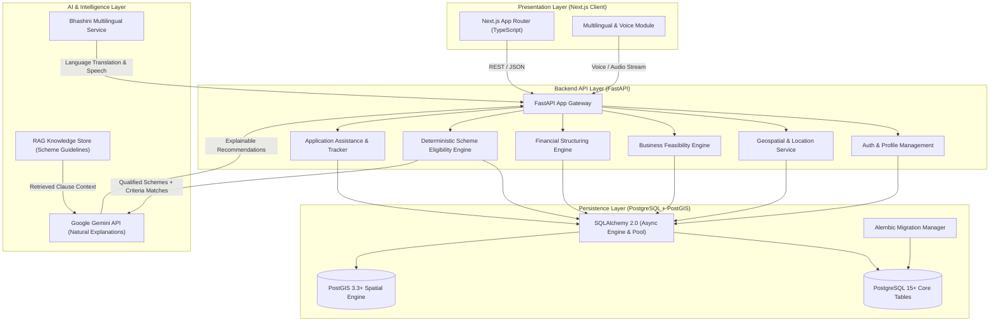

# VittMitra Architecture Specification

## 1. System Overview

VittMitra is designed with an API-first, decoupled architecture separating the Presentation Layer (Next.js), Core Business & API Layer (FastAPI), Persistence Layer (PostgreSQL with PostGIS), and Intelligence Layer (Deterministic Rule Engines + Grounded Gemini RAG Services).

---

## 2. Database & Spatial Architecture (PostgreSQL + PostGIS)

### A. Engine & Asynchronous Connection Layer
- **Database Engine**: PostgreSQL 15+ with native PostGIS 3.3+ spatial extension.
- **ORM & Dialect**: SQLAlchemy 2.0 (Asyncio) paired with `asyncpg` for high-throughput non-blocking database queries.
- **Connection Pooling**: Pre-ping enabled async connection pool (`pool_size=10`, `max_overflow=20`, `timeout=5s`) ensuring robust connection recovery.
- **Session Lifecycle**: Handled via FastAPI dependency injection (`get_db()`) yielding clean per-request transaction contexts that automatically commit on success and rollback on exceptions.

### B. PostGIS Geospatial Capability & Location Architecture
VittMitra integrates PostGIS (`CREATE EXTENSION IF NOT EXISTS postgis;`) to power location intelligence without relying on opaque third-party black boxes:
1. **Spatial Point Storage**: Entrepreneur business coordinates, shop locations, and partner locations stored as `Geometry(Point, 4326)` (WGS 84 coordinate reference system).
2. **Spatial Indexing**: GIST (Generalized Search Tree) indexes created on all geometry columns (`idx_<table>_<geom>`) for sub-millisecond proximity queries.
3. **District & Zoning Feasibility**: Location-aware scheme eligibility evaluating:
   - Special category areas (North Eastern Region / Hilly States / Island Territories).
   - Aspirational Districts (NITI Aayog prioritized developmental blocks).
   - Urban vs. Rural boundary classification using spatial polygons.
4. **Channel Partner & CSC Proximity**: Geospatial distance calculations (`ST_DWithin`, `ST_DistanceSphere`) to match entrepreneurs with the closest verified channel partner or Common Service Centre.

### C. Migration Lifecycle & Schema Versioning
- **Migration Framework**: Alembic 1.13+ configured with async execution and dynamic settings injection.
- **Spatial Object Filters**: Configured in `env.py` to preserve PostGIS internal system tables (`spatial_ref_sys`, `geometry_columns`, etc.) without unintended drops.
- **Zero-Downtime Conventions**: Standardized constraint naming conventions (`pk_`, `fk_`, `uq_`, `ix_`) ensuring reliable schema evolutions.

---

## 3. Core Architectural Separation Principles

1. **Deterministic Rule Engine (Python/SQL)**: Hard eligibility conditions (Age, Gender, Social Category, Religion, State/District, Urban/Rural status, Investment cap, Prior business experience, Disqualification triggers) are evaluated purely deterministically in code and database queries.
2. **Deterministic Financial Engine (Python/SQL)**: Mathematical calculations (Project Cost = Fixed + Working Capital, Own Contribution % based on Category, Government Subsidy %, Net Bank Loan, Amortization EMI, DSCR, Payback period) are calculated using pure deterministic logic. LLMs are NEVER used for mathematical computations.
3. **AI & RAG Engine (Gemini API)**: Generative AI is strictly tasked with:
   - Synthesizing natural-language, compassionate explanations based on deterministic match results.
   - Answering user questions about specific scheme clauses retrieved via RAG.
   - Translating and simplifying complex government notifications into conversational Indian languages.
   - Guiding document checklist preparation and post-loan business advisory.

---

## 4. Security & Data Integrity

- **Environment-Driven Configuration**: Database connection URLs (`DATABASE_URL`) configured strictly via `.env` with `.env.example` templates.
- **Sanitized Health Checks**: `/health/db` and `/health/postgis` probe active database availability while guaranteeing zero credential leakage in error responses.
- **Relational Integrity**: Foreign keys, check constraints, non-nullable flags, and UTC timezone-aware timestamps enforced across all persistent tables.
