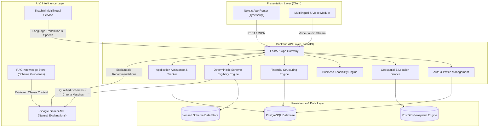

# VittMitra Architecture Specification

## 1. System Overview

VittMitra is designed with an API-first, decoupled architecture separating the Presentation Layer (Next.js), Core Business & API Layer (FastAPI), Persistence Layer (PostgreSQL with PostGIS), and Intelligence Layer (Deterministic Rule Engines + Grounded Gemini RAG Services).

---

## 2. Core Architectural Pillars

### A. Strict Separation of Deterministic Rules vs Generative AI
- **Deterministic Rule Engine (Python)**: Hard eligibility conditions (Age, Gender, Social Category, Religion, State/District, Urban/Rural status, Investment cap, Prior business experience, Disqualification triggers) are evaluated purely deterministically in Python/SQL.
- **Deterministic Financial Engine (Python)**: Mathematical calculations (Project Cost = Fixed + Working Capital, Own Contribution % based on Category, Government Subsidy %, Net Bank Loan, Amortization EMI, DSCR, Payback period) are calculated using pure deterministic logic. LLMs are NEVER used for mathematical computations.
- **AI & RAG Engine (Gemini API)**: Generative AI is strictly tasked with:
  1. Synthesizing natural-language, compassionate explanations based on deterministic match results.
  2. Answering user questions about specific scheme clauses retrieved via RAG.
  3. Translating and simplifying complex government notifications into conversational Indian languages.
  4. Guiding document checklist preparation and post-loan business advisory.

---

## 3. Communication & Contract Flow

1. **Client -> Backend**: Next.js interacts with FastAPI via strongly typed REST contracts (Pydantic models converted to TypeScript types).
2. **Backend -> Database**: Asynchronous SQL queries and spatial queries via PostGIS for district-level demographic and economic zoning.
3. **Backend -> AI Services**: Hybrid orchestration where deterministic rule matches are enriched with contextual RAG citations and passed to Gemini for explainable narrative generation.

---

## 4. Security & Compliance Strategy

- **Zero hardcoded credentials**: Environment variables managed strictly via `.env` files locally and secure secret stores in production.
- **CORS & Middleware**: Explicit origin whitelisting in FastAPI backend.
- **Data Protection**: PII minimization and encrypted storage for sensitive entrepreneur identity data.
