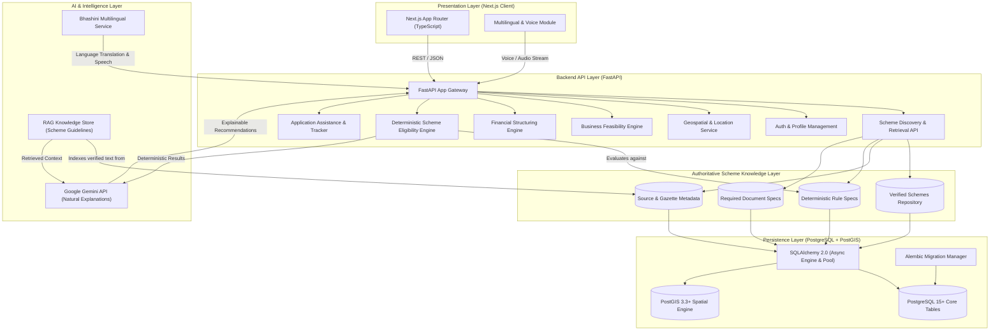

# VittMitra Architecture Specification

## 1. System Overview

VittMitra is designed with an API-first, decoupled architecture separating the Presentation Layer (Next.js), Core Business & API Layer (FastAPI), Persistence Layer (PostgreSQL with PostGIS), Scheme Knowledge Layer, and Intelligence Layer (Deterministic Rule Engines + Grounded Gemini RAG Services).

---

## 2. Scheme Knowledge Architecture & Anti-Hallucination Framework

### A. Authoritative Grounding Principle
To protect marginalized entrepreneurs from misleading advice, government scheme information is treated as an authoritative, source-traceable knowledge asset:
1. **Zero Hallucination Tolerance**: Scheme parameters (subsidy percentages, project cost limits, interest rates, age thresholds) are NEVER invented or approximated by LLMs.
2. **Every Record Source-Linked**: Each scheme record contains foreign-key relationships to `scheme_sources` containing official URLs (`kviconline.gov.in`, `standupmitra.in`, `mudra.org.in`, etc.), ministry guideline publication dates, and verification timestamps (`last_verified_at`).
3. **Explicit Data Status**: The system strictly categorizes data confidence into:
   - `VERIFIED`: Directly verified from official government gazettes, ministry circulars, or central portals.
   - `ESTIMATED`: Used only for non-legal projections (never for legal scheme eligibility).
   - `UNVERIFIED`: Explicitly flagged if authoritative source data is unavailable or undergoing revision.

### B. Separation of Scheme Knowledge vs Engines
- **Step 3 Knowledge Layer**: Stores structured, machine-readable representations of schemes, rules, sources, and documents.
- **Step 4 Eligibility Engine (Future)**: Evaluates user profiles deterministically against `scheme_eligibility_rules` via strict Boolean logic.
- **Step 5 Grounded AI / RAG (Future)**: Uses official scheme text to synthesize empathetic explanations and conversational guidance.

---

## 3. Database & Spatial Architecture (PostgreSQL + PostGIS)

- **Database Engine**: PostgreSQL 15+ with PostGIS 3.3+ spatial extension.
- **ORM & Dialect**: SQLAlchemy 2.0 (Asyncio) with `asyncpg` driver.
- **Connection Pooling**: Pre-ping enabled async connection pool (`pool_size=10`, `max_overflow=20`, `timeout=5s`).
- **Migration Framework**: Alembic 1.13+ configured with async execution and PostGIS table isolation filters.

---

## 4. Security & Data Protection

- **Public Scheme Knowledge**: Government scheme data is public and free of PII.
- **Environment Isolation**: Connection secrets managed strictly through `.env` with zero committed credentials.
- **Sanitized API Responses**: Clear separation between public API responses and internal database columns.
