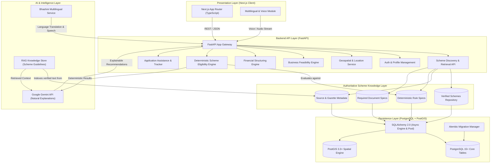

# VittMitra Architecture Specification

## 1. System Overview

VittMitra is designed with an API-first, decoupled architecture separating the Presentation Layer (Next.js), Core Business & API Layer (FastAPI), Persistence Layer (PostgreSQL with PostGIS), Scheme Knowledge Layer, and Intelligence Layer (Deterministic Rule Engines + Grounded Gemini RAG Services).



---

## 2. Deterministic Eligibility Engine Architecture `[STEP 4]`

### A. Authoritative Grounding & Non-Black-Box Principle
VittMitra's Eligibility Engine evaluates an entrepreneur's structured profile inputs against official scheme rules stored in PostgreSQL.

**Crucially, LLMs / Gemini / AI models do NOT participate in eligibility decisions.**

```
Entrepreneur Profile Input (JSON)
              ↓
Safe Field Resolver & Type Normalizer
              ↓
Active Scheme Rules from Database (is_active=True)
              ↓
Deterministic Operator Evaluation (>=, <=, ==, !=, IN, NOT_IN, CONTAINS, BOOLEAN)
              ↓
Three-State Outcome: MATCHED / FAILED / UNVERIFIED
              ↓
Rule-Specific Deterministic Explainer
              ↓
Source & Gazette Guideline Linkage
              ↓
Scheme-Level Aggregation (Mandatory vs. Optional Criteria)
              ↓
Structured API Response: POST /api/v1/eligibility/check
```

### B. The Three Core Eligibility States
1. **`MATCHED`**: Available applicant information satisfies the condition.
2. **`FAILED`**: Available applicant information clearly violates the condition.
3. **`UNVERIFIED`**: Information is missing, empty, invalidly typed, or operator cannot be safely evaluated.
   - `UNVERIFIED` is NEVER treated as `FAILED`.
   - `UNVERIFIED` is NEVER treated as `MATCHED`.
   - Missing fields are never guessed or defaulted to 0/False.

### C. Supported Rule Operators
- **Numeric**: `>=`, `>`, `<=`, `<` (with safe numeric string normalization)
- **Equality**: `==`, `!=` (supporting numbers, booleans, and case-insensitive strings)
- **Membership**: `IN`, `NOT_IN` (scalar in list or list intersection)
- **Containment**: `CONTAINS`, `NOT_CONTAINS`
- **Boolean**: `BOOLEAN`, `BOOL`
- **Fallback**: Any unrecognized operator or unconvertible type returns `UNVERIFIED`.

### D. Safe Field Resolution & Aliases
The engine resolves fields safely through a canonical alias dictionary without dynamic code evaluation:
- `age` / `applicant_age`
- `category` / `social_category` / `caste`
- `annual_income` / `income`
- `project_cost` / `investment` / `loan_amount`
- `business_stage` / `business_type`
- Compound fields like `category_or_gender` (e.g., Stand-Up India criteria)

### E. Scheme-Level Aggregation Logic
1. If **one or more mandatory rules** evaluate to `FAILED`: Overall Scheme Status = `FAILED`.
2. If **no mandatory rules** evaluate to `FAILED` but **one or more mandatory rules** are `UNVERIFIED`: Overall Scheme Status = `UNVERIFIED`.
3. If **all mandatory rules** evaluate to `MATCHED`: Overall Scheme Status = `MATCHED`.
4. Non-mandatory (advisory/optional) criteria results are preserved at the criterion level but do not fail the overall status if all mandatory criteria are satisfied.

### F. Source Traceability
Every criterion result is linked to its authoritative guideline record (`source_id`, `source_name`, `source_url`, `rule_version`).

---

## 3. Scheme Knowledge & Anti-Hallucination Framework `[STEP 3]`

1. **Zero Hallucination Tolerance**: Scheme parameters (subsidy percentages, project cost limits, interest rates, age thresholds) are NEVER invented or approximated by LLMs.
2. **Every Record Source-Linked**: Each scheme record contains foreign-key relationships to `scheme_sources` containing official URLs (`kviconline.gov.in`, `standupmitra.in`, `mudra.org.in`, etc.), ministry guideline publication dates, and verification timestamps (`last_verified_at`).
3. **Explicit Data Status**: The system strictly categorizes data confidence into:
   - `VERIFIED`: Directly verified from official government gazettes, ministry circulars, or central portals.
   - `ESTIMATED`: Used only for non-legal projections (never for legal scheme eligibility).
   - `UNVERIFIED`: Explicitly flagged if authoritative source data is unavailable or undergoing revision.

---

## 4. Database & Spatial Architecture (PostgreSQL + PostGIS)

- **Database Engine**: PostgreSQL 15+ with PostGIS 3.3+ spatial extension.
- **ORM & Dialect**: SQLAlchemy 2.0 (Asyncio) with `asyncpg` driver.
- **Connection Pooling**: Pre-ping enabled async connection pool (`pool_size=10`, `max_overflow=20`, `timeout=5s`).
- **Migration Framework**: Alembic 1.13+ configured with async execution and PostGIS table isolation filters.

---

## 5. Security & Data Protection

- **Public Scheme Knowledge**: Government scheme data is public and free of PII.
- **Client Rule Isolation**: Clients cannot manipulate authoritative rule definitions in API requests; rules are strictly queried from the trusted database.
- **Environment Isolation**: Connection secrets managed strictly through `.env` with zero committed credentials.
- **Sanitized API Responses**: Clear separation between public API responses and internal database columns.
